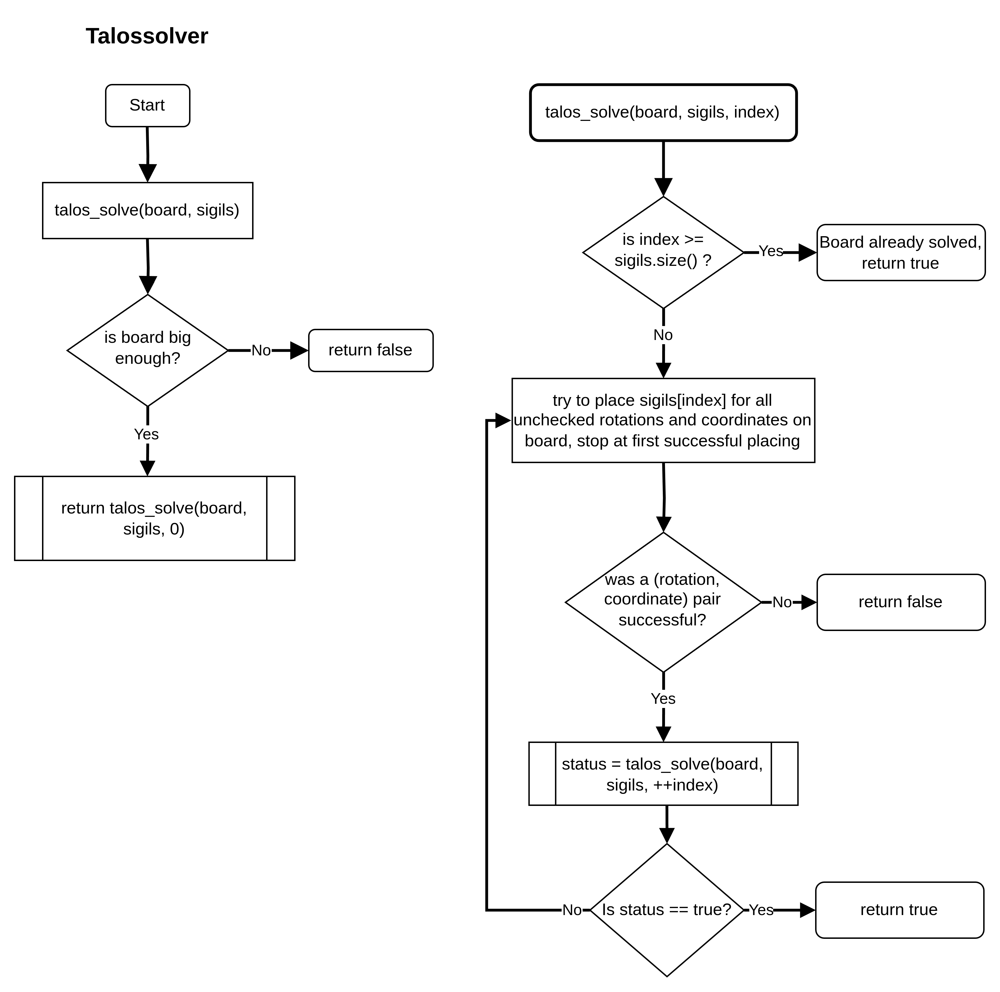

# talossolver
Solves the sigil puzzles from the game "The Talos Principle".

## Build and Usage
Inside the top level of the project folder:
 
- `cmake -B build && cmake --build build --target demo` 

and then run with

- `./build/demo`

## Algorithm flowchart

## Future work
In the future a linear programming solution could be implemented and evaluated.
